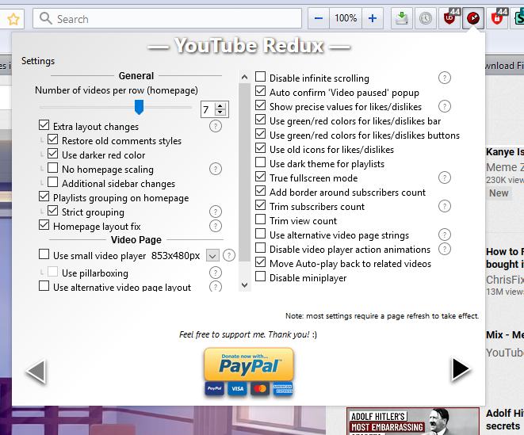
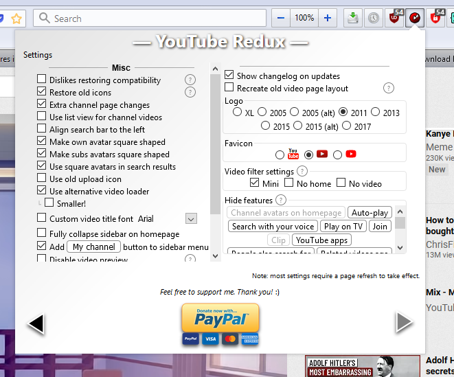

# Firefox3Theme

This is a theme for Firefox 88 to look like Firefox 3.

# Requirements (IMPORTANT)

**YOU MUST HAVE FIREFOX 57 to FIREFOX 88.0.1. WILL NOT WORK ON FIREFOX PROTON BROWSERS (v89 AND UP) OR FIREFOX AUSTRALIS BROWSERS (v56 OR LOWER)**

Make sure you have toolkit.legacyUserProfileCustomizations.stylesheets ENABLED IN about:config.

Make sure Title Bar, Menu Bar, and Bookmarks Toolbar are enabled in Customize Toolbar. You also must add at least one (1) item to the Bookmarks Toolbar to keep it visible, if you haven't enabled it before.

(*OPTIONAL*, for fuller immersion) Enable Search Bar and drag it to the right of Address Bar. Put Zoom Controls to the right of Search Bar. Enable Home Button and Reload button and place them like this: BACK - FORWARD - RELOAD - HOME

(If you really want the maximum immersion, NOT RECOMMENDED FOR BEGINNER USERS) Enable Windows Aero or use Windowblinds with BetterAeroVistaX if using Win 10 to get the Aero style. Change Firefox icon with Resource Hacker.

**YOU MUST HAVE THIS BASIC ADDONS.MOZILLA.ORG THEME INSTALLED: Firefox 3 Classic by cg-realms**

# YouTube Theme

Install the Stylus add-on and import the .json file in the repository. Then go to YouTube and enable all the styles from Stylus.

Install YouTube Redux and enable:  and 

Install Youtube - Right Side Description userscript from GreasyFork (google it) into Greasemonkey (an add-on for Firefox)

# Questions and Answers (Q&A)

*How to make this work on the latest vērsion of Firefox?*

You have to modify the theme yourself until it is proper.

*But I don't like the Menu Bar or Bookmarks Toolbar!*

Too bad then your theme will be broken (I don't mean immersion will be lost, I mean the theme will be literally **broken**)

